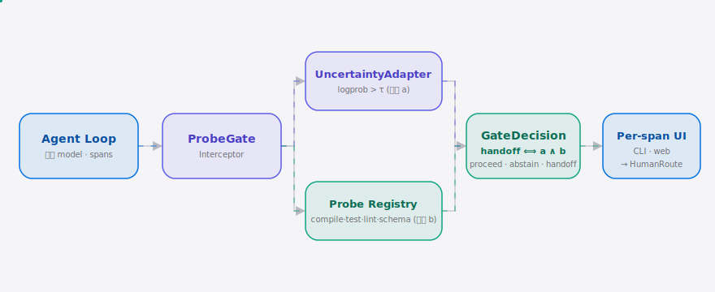

[English](./README.en.md) | **简体中文**

<p align="center">
  <picture>
    <source media="(prefers-color-scheme: dark)" srcset="./assets/hero-dark.svg">
    <source media="(prefers-color-scheme: light)" srcset="./assets/hero-light.svg">
    
  </picture>
</p>

<p align="center"><sub>把模型自报不确定度与机器可校验探针配对，仅当双信号同时触发才路由人工——国产模型自治 agent 的 per-span 兜底门。</sub></p>

<p align="center">
  <a href="./LICENSE"></a>
  <a href="https://github.com/SuperMarioYL/probegate/releases"></a>
  <a href="https://github.com/SuperMarioYL/probegate/actions/workflows/ci.yml"></a>
  
</p>

**一句话**：你的国产模型 agent 在没把握的步骤上硬编下去——ProbeGate 用「compile/test/lint/schema 探针 ∧ 模型自报不确定度」的 AND 门，只在双信号同时触发时拦下这一 span 找人确认，其余放行。

<h2> 架构</h2>

<p align="center">
  <picture>
    <source media="(prefers-color-scheme: dark)" srcset="./assets/atlas-dark.svg">
    <source media="(prefers-color-scheme: light)" srcset="./assets/atlas-light.svg">
    
  </picture>
</p>

核心不变式：

```
handoff ⟺ uncertainty > τ  AND  not probe.passed
```

单信号都不足以兜底——这正是 ProbeGate 与既有路线的根本区分：[cactus-compute/cactus-hybrid](https://github.com/cactus-compute/cactus-hybrid) 只信模型自白（黑盒解释幻觉），[sickn33/agentic-awesome-skills](https://github.com/sickn33/agentic-awesome-skills) 的 stack validation 拥有探针层但没接成 in-flight 兜底门。ProbeGate 把国产模型 serving tier 自报置信度最不可信处当成楔子，用 AND 门 + per-span UI 兜住「confidence 虚高 ∧ 探针真失败」的 span。

**三态门**：`proceed`（双清，放行）· `abstain`（单信号，标记但不拦）· `handoff`（双触发，路由人工）。

<h2> 安装 + 快速开始</h2>

```bash
pip install probegate
probegate init                              # 生成 .probegate.toml（选探针 + 阈值 τ）
probegate demo --model deepseek-coder       # 跑内置 5 步 demo agent，第 4 步弹门
```

<details><summary>样例输出</summary>

```
┏━━━━━━━━━━━━━━ ProbeGate demo ━━━━━━━━━━━━━━┓
┃ model=deepseek-coder  probe=compile  tau=0.5┃
┗━━━━━━━━━━━━━━━━━━━━━━━━━━━━━━━━━━━━━━━━━━━━┛
╭─ span span-1 ───────────────────────────╮
│ span      span-1
│ uncertainty 0.08
│ probe     compile → PASS
│ rule      proceed
│
│ uncertainty 0.08 <= tau 0.50 AND probe 'compile' passed
╰─────────────────────────────────────────╯
...
╭─ span span-4 ───────────────────────────╮     ← 故意编错函数签名
│ uncertainty 0.82
│ probe     compile → FAIL
│ rule      handoff                          ← 双信号触发，路由人工
╰─────────────────────────────────────────╯
```

</details>

<h2> 用法</h2>

在 agent loop 外包一层 `ProbeGate`：

```python
from probegate import ProbeGate, Span

with ProbeGate(uncertainty_threshold=0.5, probe="compile") as g:
    for span in agent.run():              # 国产模型每走一步吐一个 span
        decision = g.guard(span)          # (a) 不确定度 ∧ (b) 探针 → 三态
        if decision.rule == "handoff":    # 双信号才拦
            if not ask_human(span):       # N → agent 回退重走该 span
                rewind(span)
```

常用子命令：

| 命令 | 作用 |
|---|---|
| `probegate init` | 写 `.probegate.toml`（阈值 τ / 探针 / model target） |
| `probegate demo --model deepseek-coder` | 内置 5 步 agent，第 4 步故意编错签名触发 handoff |
| `probegate gate --demo --probe compile` | 在内置 demo spans 上跑门，打印每 span 三态 |
| `probegate gate --fake-spans demo.jsonl` | 在自己的 jsonl span 流上跑门 |
| `probegate ui --port 8000` | 起本地 FastAPI web 视图，浏览器看 per-span 卡片 + Approve/Reject |

jsonl span 格式（每行一个）：

```json
{"id": "s4", "agent_step": 4, "content": "def f(:\n    pass\n", "uncertainty": 0.82}
```

<h2> Demo</h2>

<p align="center"></p>

60s 录屏：DeepSeek-Coder agent 第 4 步低置信 span 触发 compile 探针失败 → ProbeGate 弹出 per-span 人工兜底门；对比未装 gate 的级联翻车。

<h2> 配置</h2>

`.probegate.toml`（`probegate init` 生成）：

| key | type | default | 含义 |
|---|---|---|---|
| `uncertainty_threshold` | float | `0.5` | τ——span 不确定度超过它 **且** 探针失败才 handoff |
| `probe` | `compile\|test\|lint\|schema` | `compile` | 机器可校验探针，m1 默认 compile |
| `model_target` | string | `deepseek-coder` | 国产模型 serving target（`deepseek-coder` / `qwen3-coder` / `glm-5`） |
| `handoff_mode` | `cli\|web` | `cli` | 兜底门在 CLI prompt 还是本地 web 视图弹出 |
| `api_key` | string? | `""` | 国产模型 API key（m3：拉 logprob） |
| `base_url` | string? | `""` | OpenAI 兼容 base URL（m3：拉 logprob） |

<h2> 付费 / Pricing</h2>

| 套餐 | 价格 | 覆盖 |
|---|---|---|
| **ProbeGate OSS** | 免费 / MIT | 本地 dual-signal 门 + 全部探针 + CLI + 本地 web 视图（v0.1 已交付） |
| **ProbeGate Team** | ¥499/seat/年（¥49/seat/月） | 审计日志导出 · SSO/团队账号 · hosted per-span 门中继（v0.2+ 收费锚点） |

商业路径明确面向中文 SME 团队把 agent 接进生产（客服 / 数据分析 / 报表），一次 10 步级联回滚烧掉的半个 dev-day 就够买一年席位。v0.1 只发 OSS 核心，Team 扩展是 v0.2+ 的收费锚点，不是 vaporware。Team 试用：`probegate.dev/team`。

<h2> 路线图</h2>

- [x] **m1 — 双信号 AND 门**：`GateDecision` + 不确定度 ∧ compile 探针 + 假 span 流 + CLI 三态打印
- [ ] **m2 — per-span web 视图**：FastAPI 渲染 trajectory，每 span 一张卡片（不确定度 / 探针结果 / 门状态 / Approve-Reject），接 m1 的 GateDecision
- [ ] **m3 — 接国产模型 logprob**：UncertaintyAdapter 接 DeepSeek-Coder / Qwen3-Coder / GLM API + 补 test/lint/schema 探针 + 10 分钟对比 demo 录屏
- [ ] v0.2 — ProbeGate Team：审计日志导出、SSO、hosted 门中继

<h2> License + Contributing</h2>

MIT，见 [LICENSE](./LICENSE)。提 issue / PR：[github.com/SuperMarioYL/probegate/issues](https://github.com/SuperMarioYL/probegate/issues)。

推送后建议加 topics：`gh repo edit --add-topic agent --add-topic abstention --add-topic deepseek --add-topic qwen --add-topic glm`。

<p align="center"><sub><a href="./LICENSE">MIT</a> © 2026 SuperMarioYL</sub></p>
